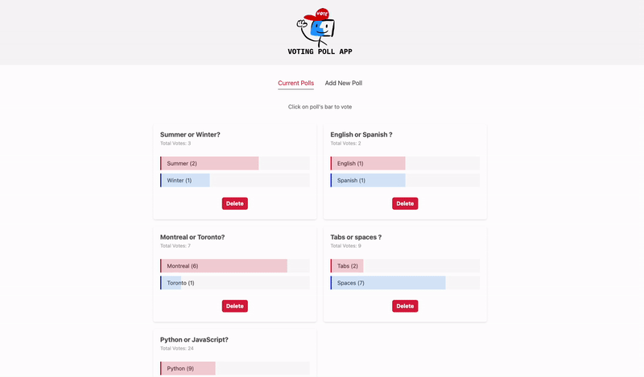

# svelte-polls-voting-app

A fun Polls voting app built with Svelte, featuring engaging animations.

Easily create, vote on, and view poll results with a dynamic and interactive user experience.

## Live Demo


## Prerequisites
- **Node.js :** Make sure Node.js is installed. You can download it from [nodejs.org](https://nodejs.org/en).
- **Git :** Ensure Git is installed to clone the repository.

## Getting started
1. **Clone the Repository :**
```bash
git clone https://github.com/jaunewick/svelte-polls-voting-app.git
cd svelte-polls-voting-app
```

2. **Install Dependencies :**
```bash
npm install
```

3. **Run the Application :**
```bash
npm start
```
4. **Access the App :**
Open your browser and go to http://localhost:8000 to see the app in action.
